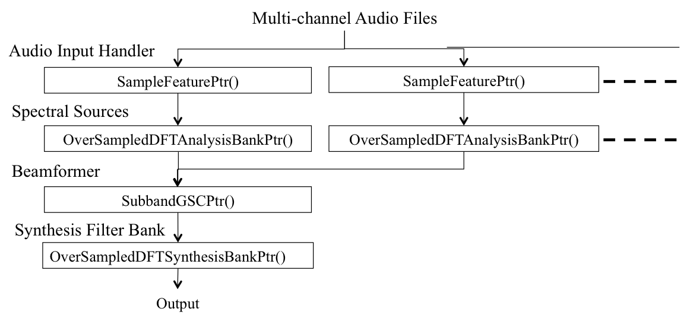

.. _sec-bf:

Beamforming
===========================

Acoustic beamforming can strengthen a signal propagating from a particular direction or position and suppress interfering signals [VSR13]_ [WM09]_ [TRE02]_. Such beamformers can be quickly implemented with `BTK`_. 

:numref:`fig-bod` illustrates a dependency graph of the feature pointer objects for building a beamformer. As shown in :numref:`fig-bod`, we create multiple spectral objects, *OverSampledDFTAnalysisBankPtr()*, from the multi-channel audio signal and then feed them into the beamformer object, *SubbandGSCPtr()*. The beamformed subband component will be transformed back into the time domain through the *OverSampledDFTSynthesisBankPtr()*. 

We can easily try a different beamforming algorithm by replacing the beamforming object or cascade various processing methods by inserting before/after the beamformer process. 

Object dependency for subband beamforming

The basic type of beamforming algorithms would be a data-independent method such as delay-and-sum (D&S) and super-directive (SD) beamformers [BS01]_. The data-independent beamformers use the theoretical noise coherence model.

You may sometimes want to adapt a beamformer to a specific acoustic environment with a few observations. Adapting the beamformer with a few amount of data is cheaper than building multiple beamformers with a large amount of data. As you can imagine, there are many publications that claim to describe a new beamforming algorithm. In terms of a necessary amount of adaptation data in running time, the beamforming techniques can be classified into two types of algorithms:

* Online processing that outputs a processed signal on a sample-by-sample or block-by-block basis in real time, and 

* Batch processing that requires one utterance, typically 2 or more seconds, to capture enough statistics of the signal. 

:numref:`test_online_beamforming` shows a sample python script that runs online beamforming algorithms. Delay-and-sum (D&S), super-directive (SD), linear constrained minimum variance (LCMV),  generalized sidelobe canceller (GSC) recursive least squares (RLS) and GSC least mean-square (LMS) beamformers can fall into this class of algorithms. 

In the case that the positions of sound sources do not change, we would rather use a more amount of stationary data for weight estimation than update it sample-by-sample quickly. That can be, for instance, done with a minimum variance distortionless response (MVDR) or generalized eigenvector (GEV) beamformer. `BTK`_ also provides such beamforming methods in `unit_test/test_sos_batch_beamforming`_. 

The beamforming techniques mentioned above only use second order statistics (SOS) of the signal. It is well-known that the distribution of the clean speech signal cannot be represented only with the SOS [KMB12]_. Speech enhancement performance can be further improved by incorporating higher-order statistics (HOS) into beamforming. It is also implemented in `BTK`_. Both SOS and HOS beamforming algorithms can co-exist under the GSC framework. 

The spherical array is another interesting beamforming topic because of the elegant closed form solution in the spherical harmonics domain [ME04]_. Spherical harmonics beamforming techniques would be suitable for three dimensional sound field reconstruction. Obviously, the beamforming performance will not be affected with respect to a direction of arrival in contrast to the linear array [KMB12]_. The spherical harmonics beamformers are also implemented. 

.. note::  The acoustic beamforming techniques will require prior knowledge: 1) geometric information or 2) sound source activity indicator. In the examples below, such information is specified in a JSON configuration file. The methods to estimate such information will be described later. The use of prior knowledge indeed distinguishes acoustic beamforming from blind source separation techniques that can be unstable in the case that a limited amount of adaptation or training data is only available. 

.. literalinclude:: examples/test_online_beamforming.py
    :language: python
    :linenos:
    :caption: Script including online beamformers: unit_test/test_online_beamforming
    :name: test_online_beamforming

.. _sec-ds-bf: 

Data Independent Beamforming
------------------------------------------------

Delay-and-sum (D&S) Beamforming
~~~~~~~~~~~~~~~~~~~~~~~~~~~~~~~~

The D&S beamformer is implemented as one of options in "`unit_test/test_online_beamforming`_".  To try D&S beamforming only, run that script in your Git repository as

.. sourcecode:: bash

   $ cd ${YOUR_GIT_REPOSITORY}/unit_test
   $ python test_online_beamforming.py \
          -c confs/ds.json \
          -i data/CMU/R1/M1005/KINECT/RAW/segmented/U1001_1M_16k_b16_c1.wav \
             data/CMU/R1/M1005/KINECT/RAW/segmented/U1001_1M_16k_b16_c2.wav \
             data/CMU/R1/M1005/KINECT/RAW/segmented/U1001_1M_16k_b16_c3.wav \
             data/CMU/R1/M1005/KINECT/RAW/segmented/U1001_1M_16k_b16_c4.wav \
         -o out/U1001_1M_ds.wav

This will generate a beamformed audio file as out/U1001_1M_ds.wav. 

.. _sec-sd-bf:

Super-Directive Beamforming
~~~~~~~~~~~~~~~~~~~~~~~~~~~~~

The super-directive beamforming [BS01]_ is optimum for the spherically isotropic (diffuse) noise field. It can be also viewed as a special case of minimum variance distortionless beamforming where the noise coherence matrix is fixed. 

SD beamforming can be done by giving the "`unit_test/confs/sd.json`_" JSON to the "`unit_test/test_online_beamforming`_" Python script as

.. sourcecode:: bash

   $ python test_online_beamforming.py \
          -c confs/sd.json \
          -i data/CMU/R1/M1005/KINECT/RAW/segmented/U1001_1M_16k_b16_c1.wav \
             data/CMU/R1/M1005/KINECT/RAW/segmented/U1001_1M_16k_b16_c2.wav \
             data/CMU/R1/M1005/KINECT/RAW/segmented/U1001_1M_16k_b16_c3.wav \
             data/CMU/R1/M1005/KINECT/RAW/segmented/U1001_1M_16k_b16_c4.wav \
         -o out/U1001_1M_sd.wav

Here, the JSON file for SD beamforming looks:

.. sourcecode:: bash

   $ cat confs/sd.json
   {"array_type":"linear",
    "microphone_positions":[[-113.0, 0.0, 2.0],
                         [  36.0, 0.0, 2.0],
                         [  76.0, 0.0, 2.0],
                         [ 113.0, 0.0, 2.0]],
    "target":{"positions":[[0.0, [-1.306379, null, null]]]},
    "beamformer":{"type":"super_directive", "diagonal_load":0.01}
   }

.. tip:: You can adjust white noise gain by changing an amount of diagonal loading, specified with ["beamformer"]["diagonal_load"] in the JSON file or at line 172 in :numref:`test_online_beamforming`. The smaller diagonal loading value indicates a sharper directivity but less white noise gain. 

LCMV beamforming
~~~~~~~~~~~~~~~~~

Beamforming can also place null on a signal coming from a particular direction. It is sometimes called null-steering beamforming. The linear constrained minimum variance (LCMV) beamformer  can be viewed as a general form of delay-and-sum and null-steering beamformers. By specifying the direction of each sound source, the LCMV beamformer can strengthen or null out the source. 

The following command will do LCMV beamforming. 

.. sourcecode:: bash

   $ python test_online_beamforming.py \
         -c confs/lcmv_and_zelinski.json \
         -i data/CMU/R1/M1005/KINECT/RAW/segmented/U1001_1M_16k_b16_c1.wav \
            data/CMU/R1/M1005/KINECT/RAW/segmented/U1001_1M_16k_b16_c2.wav \
            data/CMU/R1/M1005/KINECT/RAW/segmented/U1001_1M_16k_b16_c3.wav \
            data/CMU/R1/M1005/KINECT/RAW/segmented/U1001_1M_16k_b16_c4.wav \
         -o out/U1001_1M_lcmvz.wav

Compare the input file with the output file to see that the LCMV beamformer can weaken the signal.

SOS Adaptive Beamforming
----------------------------------------------------

.. tip:: We would recommend you read Chapter 6 and 7 in [TRE02]_ if you don't do so. Once you go through the book [TRE02]_, you will find many recent publications on adaptive beamforming and source separation techniques merely describe a variant of the methods explained in [TRE02]_. Many algorithms address how to estimate an optimal weight with a small amount of adaptation data based on the *second order statistics* (SOS).

Among hundreds of SOS-based beamforming, `BTK`_  provides four representative beamformers as follows.

.. _sec-gsc-rls-bf:

GSC RLS Beamforming
~~~~~~~~~~~~~~~~~~~~~~~~~~~~~~~~~~~~~~~~~~~~~~~~~~~~~~

There was a great deal of attention paid to research on recursive weight update algorithms for adaptive filtering instead of batch update. The recursive implementation is suitable for real-time processing. 
The `BTK`_ provides a generalized sidelobe canceller recursive least squares (GSC-RLS) beamformer with quadratic constraints; see section 4.4 in [TRE02]_ for the detail. 

You can test GSC-RLS beamforming by running "`unit_test/test_online_beamforming`_" with "`unit_test/confs/gscrls.json`_":

..  sourcecode:: bash

   $ python test_online_beamforming.py \
         -c confs/gscrls.json \
         -i data/CMU/R1/M1005/KINECT/RAW/segmented/U1001_1M_16k_b16_c1.wav \
            data/CMU/R1/M1005/KINECT/RAW/segmented/U1001_1M_16k_b16_c2.wav \
            data/CMU/R1/M1005/KINECT/RAW/segmented/U1001_1M_16k_b16_c3.wav \
            data/CMU/R1/M1005/KINECT/RAW/segmented/U1001_1M_16k_b16_c4.wav \
         -o out/U1001_1M_gscrls.wav

The GSC-RLS beamformer actually has hyper-parameters to be tuned for stabilizing active weight estimation. :numref:`hparam4gscrls` lists the hyper-parameters for GSC-RLS beamforming. 

.. table:: Hyperparameters for GSC-RLS beamforming class
   :widths: auto
   :name: hparam4gscrls

   +-----------------------+----------------------------------------------------------+
   | Hyperparameter        | What is this?                                            |
   +=======================+==========================================================+
   | beta                  | Forgetting factor to Smooth an power estimate            |
   +-----------------------+----------------------------------------------------------+
   | gamma                 | Step size factor to control a speed of weight estimation |
   +-----------------------+----------------------------------------------------------+
   | mu                    | Forgetting factor to forget observations in the past     |
   +-----------------------+----------------------------------------------------------+
   | init_diagonal_load    | Initial value for the power estimate                     |
   +-----------------------+----------------------------------------------------------+
   | regularization_param  | Parameter to regularize the large weight vector value    |
   +-----------------------+----------------------------------------------------------+
   | sil_thresh            | Silence power threshold used for determining whether the |
   |                       | weight vector is updated or not                          |
   +-----------------------+----------------------------------------------------------+
   | constraint_option     | Constraint option for weight estimation:                 |
   |                       | 1. Quadratic constraint,                                 |
   |                       | 2. Weight vector norm normalization                      |
   |                       | 3. Hybrid of two methods                                 |
   +-----------------------+----------------------------------------------------------+
   | alpha2                | Quadratic constraint so as to keep \|wa\|^2 <= alpha2    |
   +-----------------------+----------------------------------------------------------+
   | max_wa_l2norm         | Norm normalization parameter to limit the vector norm:   |
   |                       | \|wa\|^2 == max_wa_l2norm                                |
   +-----------------------+----------------------------------------------------------+
   | min_frames            | Start updating weights after "min_frames" observations   |
   +-----------------------+----------------------------------------------------------+
   | slowdown_after        | Decrease a step size after "slowdown_after" frames       |
   +-----------------------+----------------------------------------------------------+

.. _sec-gsc-lms-bf:

GSC LMS Beamforming
~~~~~~~~~~~~~~~~~~~~~~~~~~~~~~~~~~~~~~~~~~~~~~~~~~~

The least mean square (LMS) is a stochastic version of the steepest algorithm. The computational cost of the LMS beamformers would be less expensive than that of the RLS implementation due to no need of Kalman gain computation for the inverse of a sample spectral matrix. However, the convergence speed of the LMS beamformers will depend on the eigenvalue spread. 

The `BTK`_ implements the power normalized LMS (PN-LMS) beamformer configured in GSC [TRE02]_. In the same way as described above, run "`unit_test/test_online_beamforming`_" but with a JSON configuration file "`unit_test/confs/gsclms.json`_":

.. sourcecode:: bash

   $ python test_online_beamforming.py \
        -c confs/gsclms.json \
         -i data/CMU/R1/M1005/KINECT/RAW/segmented/U1001_1M_16k_b16_c1.wav \
            data/CMU/R1/M1005/KINECT/RAW/segmented/U1001_1M_16k_b16_c2.wav \
            data/CMU/R1/M1005/KINECT/RAW/segmented/U1001_1M_16k_b16_c3.wav \
            data/CMU/R1/M1005/KINECT/RAW/segmented/U1001_1M_16k_b16_c4.wav \
        -o out/U1001_1M_gsclms.wav

The convergence performance of the LMS beamformer is also very sensitive to a rapid acoustic change. :numref:`hparam4gsclms` shows the hyper-parameters to control an adaptation speed, leakage degree and regularization term. 

.. table:: Hyperparameters for GSC-LMS beamforming class
   :widths: auto
   :name: hparam4gsclms

   +-----------------------+----------------------------------------------------------+
   | Hyperparameter        | What is this?                                            |
   +=======================+==========================================================+
   | beta                  | Forgetting factor to Smooth an power estimate            |
   +-----------------------+----------------------------------------------------------+
   | gamma                 | Step size factor to control a speed of weight estimation |
   +-----------------------+----------------------------------------------------------+
   | init_diagonal_load    | Initial value for the power estimate                     |
   +-----------------------+----------------------------------------------------------+
   | regularization_param  | Leak amount to avoid a large weight change               |
   +-----------------------+----------------------------------------------------------+
   | energy_floor          | Value to floor the small signal energy                   |
   +-----------------------+----------------------------------------------------------+
   | sil_thresh            | Silence power threshold used for determining whether the |
   |                       | weight vector is updated or not                          |
   +-----------------------+----------------------------------------------------------+
   | max_wa_l2norm         | Norm normalization parameter to limit the vector norm:   |
   |                       | \|wa\|^2 == max_wa_l2norm                                |
   +-----------------------+----------------------------------------------------------+
   | min_frames            | Start updating weights after "min_frames" observations   |
   +-----------------------+----------------------------------------------------------+
   | slowdown_after        | Decrease a step size after "slowdown_after" frames       |
   +-----------------------+----------------------------------------------------------+

MVDR Beamforming with Sample Matrix Inversion (SMI)
~~~~~~~~~~~~~~~~~~~~~~~~~~~~~~~~~~~~~~~~~~~~~~~~~~~~~~~~~~~~~~

The BTK provides two popular MVDR beamforming implementations: the sighted and blind MVDR beamformers [SBA10]_. You can try those beamformers with `unit_test/test_sos_batch_beamforming`_. Each method requires a different kind of prior knowledge. The location of the target source has to be given to the sighted MVDR beamformer while the blind MVDR implementation does not require the look directions. In general, blind beamforming algorithms will need more precise speech and noise segmentation information. Such information can be specified in a JSON configuration file for `unit_test/test_sos_batch_beamforming`_. Let us take a look at both cases. 

Clear-sighted approach
"""""""""""""""""""""""""""""""""""""

For the sighted MVDR beamformer, you will need to specify a position estimate and speech activity segment in a JSON form as

.. sourcecode:: bash

  $ cat confs/smimvdr.json
  {"array_type":"linear",
   "microphone_positions":[[-113.0, 0.0, 2.0],
                           [  36.0, 0.0, 2.0],
                           [  76.0, 0.0, 2.0],
                           [ 113.0, 0.0, 2.0]],
   "target":{"positions":[[0.0, [-1.306379, null, null]]],
             "vad_label":[[1.5, 4.0]]},
   "beamformer":{"type":"smimvdr",
                 "mu":1e-4,
                 "energy_threshold":10}
  }

As shown above, this JSON file has array geometry as well as the direction of the target source. It also specifies the start and end time of voice activity in the "vad_label" key.  The noise covariance matrix will be computed from non-speech signals with the greater than "energy_threshold" energy. Diagonal loading will be performed for noise covariance matrix inversion by adding the value in the "mu" key. By feeding the JSON file above, you can run the MVDR beamformer as

.. sourcecode:: bash

   $ cd ${your_Git_repository}
   $ python test_sos_batch_beamforming.py \
        -c confs/smimvdr.json \
         -i data/CMU/R1/M1005/KINECT/RAW/segmented/U1001_1M_16k_b16_c1.wav \
            data/CMU/R1/M1005/KINECT/RAW/segmented/U1001_1M_16k_b16_c2.wav \
            data/CMU/R1/M1005/KINECT/RAW/segmented/U1001_1M_16k_b16_c3.wav \
            data/CMU/R1/M1005/KINECT/RAW/segmented/U1001_1M_16k_b16_c4.wav \
        -o out/U1001_1M_smimvdr.wav

Blind approach
"""""""""""""""""""""""""""
The MVDR criterion can be also achived without the look direction [SBA10]_. This is also known as the minimum mean square error (MMSE) beamformer [TRE02]_. For this, you will only need to specify the region of the target and noise signals as

.. sourcecode:: bash

   $ cd ${your_Git_repository}
   $ cat confs/bmvdr_vad.json
   {
   "target":{"vad_label":[[1.5, 4.0]]},
   "beamformer":{"type":"bmvdr",
                 "energy_threshold":10,
                 "ref_micx":0,
                 "offset":0.0}
   }

Here, you can change the reference microphone index with the "ref_micx" value. With the "offset" value, you can adjust a SNR gain. Then, we can run the sample script with that JSON file as 

.. sourcecode:: bash

   $ python test_sos_batch_beamforming.py \
        -c confs/bmvdr_vad.json \
         -i data/CMU/R1/M1005/KINECT/RAW/segmented/U1001_1M_16k_b16_c1.wav \
            data/CMU/R1/M1005/KINECT/RAW/segmented/U1001_1M_16k_b16_c2.wav \
            data/CMU/R1/M1005/KINECT/RAW/segmented/U1001_1M_16k_b16_c3.wav \
            data/CMU/R1/M1005/KINECT/RAW/segmented/U1001_1M_16k_b16_c4.wav \
        -o out/U1001_1M_bmvdr_vad.wav

The VAD label described above does not contain source activity information for each frequency band. The straightforward idea is providing the beamformer with time-frequency (TF) masks which indicate subband activity of each sound source [HDH16]_. We can do it by specifying the mask file paths to the target and noise sources as 

.. sourcecode:: bash

   $ cd ${your_Git_repository}
   $ cat confs/bmvdr_vad.json
   {
   "target":{"tfmask_path":"data/CMU/R1/M1005/KINECT/RAW/segmented/U1001_1M_16k.speech.tfmask.pickle"},
   "noises":[{"tfmask_path":"data/CMU/R1/M1005/KINECT/RAW/segmented/U1001_1M_16k.noise.tfmask.pickle"}],
   "beamformer":{"type":"bmvdr",
                 "energy_threshold":10,
                 "ref_micx":0,
                 "offset":0.0}
   }

The Python pickle files specified in the "tfmask_path" key contain a sequence (number of frames) of mask value vectors for the target and noise sources. With this JSON file, we can run the blind MVDR beamformer as

.. sourcecode:: bash

   $ python test_sos_batch_beamforming.py \
        -c confs/bmvdr_tfmask.json \
         -i data/CMU/R1/M1005/KINECT/RAW/segmented/U1001_1M_16k_b16_c1.wav \
            data/CMU/R1/M1005/KINECT/RAW/segmented/U1001_1M_16k_b16_c2.wav \
            data/CMU/R1/M1005/KINECT/RAW/segmented/U1001_1M_16k_b16_c3.wav \
            data/CMU/R1/M1005/KINECT/RAW/segmented/U1001_1M_16k_b16_c4.wav \
        -o out/U1001_1M_bmvdr_tfmask.wav

The example here actually provides an ideal mask computed from close-talking microphone data. The mask can be estimated through a neural network trained with a pair of the clean and artificially-corrupted data [HDH16]_ [HKIK+18]_. You can, for example, use Paderborn University's toolkit `nn-gev`_. 

Generalized Eigenvector  (GEV) Beamforming
~~~~~~~~~~~~~~~~~~~~~~~~~~~~~~~~~~~~~~~~~~~~~~~~~~~~

Another popular blind beamformer is generalized eigenvector (GEV) beamforming [WH07]_  [HDH16]_. The GEV beamformer can be built in the same manner as the blind MVDR beamformer.  The simpler way is just feeding a voice activity segment label without frequency information as 

.. sourcecode:: bash

   $ cd ${your_Git_repository}
   $ cat confs/gev_vad.json
   {
   "target":{"vad_label":[[1.5, 4.0]]},
   "beamformer":{"type":"gev",
                 "energy_threshold":10}
   }

And run the following command:
 
.. sourcecode:: bash

   $ python test_sos_batch_beamforming.py \
        -c confs/gev_vad.json \
         -i data/CMU/R1/M1005/KINECT/RAW/segmented/U1001_1M_16k_b16_c1.wav \
            data/CMU/R1/M1005/KINECT/RAW/segmented/U1001_1M_16k_b16_c2.wav \
            data/CMU/R1/M1005/KINECT/RAW/segmented/U1001_1M_16k_b16_c3.wav \
            data/CMU/R1/M1005/KINECT/RAW/segmented/U1001_1M_16k_b16_c4.wav \
        -o out/U1001_1M_gev_vad.wav

Again, we can specify sound source activity per frequency bin in the same way as blind MVDR beamforming:

.. sourcecode:: bash

   $ cd ${your_Git_repository}
   {
   "target":{"tfmask_path":"data/CMU/R1/M1005/KINECT/RAW/segmented/U1001_1M_16k.speech.tfmask.pickle"},
   "noises":[{"tfmask_path":"data/CMU/R1/M1005/KINECT/RAW/segmented/U1001_1M_16k.noise.tfmask.pickle"}],
   "beamformer":{"type":"gev",
                 "energy_threshold":10}
   }

And do TF mask-based beamforming as follows.  

.. sourcecode:: bash

   $ python test_sos_batch_beamforming.py \
        -c confs/gev_tfmask.json \
         -i data/CMU/R1/M1005/KINECT/RAW/segmented/U1001_1M_16k_b16_c1.wav \
            data/CMU/R1/M1005/KINECT/RAW/segmented/U1001_1M_16k_b16_c2.wav \
            data/CMU/R1/M1005/KINECT/RAW/segmented/U1001_1M_16k_b16_c3.wav \
            data/CMU/R1/M1005/KINECT/RAW/segmented/U1001_1M_16k_b16_c4.wav \
        -o out/U1001_1M_gev_tfmask.wav

The GEV beamformer attempts at maximizing the output signal-to-noise ratio (SNR).  You may feel GEV beamforming does not suppress noise as much as the other beamformers do. However, the target signal is emphasized. 

.. note:: You will need to install `scipy`_ for The GEV beamformer.

.. warning:: The best case scenario for conventional adaptive beamformers is the *static* acoustic environment where both target and noise source positions are fixed and located at different positions. Adaptive beamforming may degrade speech recognition accuracy in complex acoustic environments in the case that either a speaker or noise source moves or sound presence timing varies because of steering errors [SU96]_. 

HOS Adaptive Beamforming
---------------------------------------------------------

In practice, these adaptive beamformers with the second-order statistics could suppress the desired signal as well as noise. 
The key technique for avoiding the *signal cancellation effect* would be 

* Using a different criterion for optimization [KMB12]_, 

* Locating a desired source position accurately or 

* Estimating each source activity [HDH16]_ [HKIK+18]_. 

This section describes a beamforming technique with the maximum super-Gaussian criterion, which turned out to be robust against the reverberation and beam steering error.

Maximum Kurtosis Beamforming
~~~~~~~~~~~~~~~~~~~~~~~~~~~~~
[KMRG+08]_

Maximum Negentropy Beamforming
~~~~~~~~~~~~~~~~~~~~~~~~~~~~~~
[KMRK+09]_

.. warning:: In order to achieve the best enhancement performance, the SMI-MVDR, GEV and maximum SG beamformers require a certain amount of data, around1 to 2 seconds [KMR11]_ [HKIK+18]_. 

.. _sec-sphbf:

Spherical Beamforming
---------------------------------------------------------
[ME04]_

Spherical Harmonics D&S Beamforming
~~~~~~~~~~~~~~~~~~~~~~~~~~~~~~~~~~~~

Spherical Harmonics SD Beamforming
~~~~~~~~~~~~~~~~~~~~~~~~~~~~~~~~~~~~

.. _BTK: https://distantspeechrecognition.sourceforge.io/index.htm
.. _unit_test/confs/ds.json: https://github.com/kkumatani/distant_speech_recognition/blob/master/btk20_src/unit_test/confs/ds.json
.. _unit_test/confs/sd.json: https://github.com/kkumatani/distant_speech_recognition/blob/master/btk20_src/unit_test/confs/sd.json
.. _unit_test/confs/lcmv_and_zelinski.json: https://github.com/kkumatani/distant_speech_recognition/blob/master/btk20_src/unit_test/confs/lcmv_and_zelinski.json
.. _unit_test/confs/gscrls.json: https://github.com/kkumatani/distant_speech_recognition/blob/master/btk20_src/unit_test/confs/gscrls.json
.. _unit_test/confs/gsclms.json: https://github.com/kkumatani/distant_speech_recognition/blob/master/btk20_src/unit_test/confs/gsclms.json
.. _unit_test/test_online_beamforming: https://github.com/kkumatani/distant_speech_recognition/blob/master/btk20_src/unit_test/test_online_beamforming.py
.. _unit_test/test_sos_batch_beamforming: https://github.com/kkumatani/distant_speech_recognition/blob/master/btk20_src/unit_test/test_sos_batch_beamforming.py
.. _nn-gev: https://github.com/fgnt/nn-gev/commits
.. _scipy: https://www.scipy.org/
