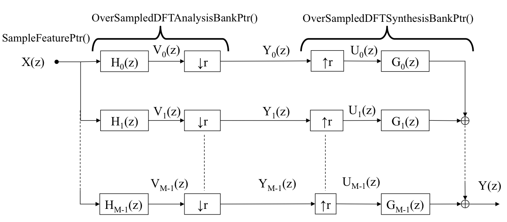

.. _sec-sbp:

Subband Processing
===========================

Speech signal processing is typically performed in the frequency domain for the sake of computational efficiency. Subband processing is an elegant way of transforming a block of speech signal between the time and frequency domains. In applying subband processing to adaptive filtering, we will need to reduce the *aliasing distortion* effect caused by arbitrary magnitude scaling and phase shifting. This page explains how subband processing can be implemented in the BTK. 

Oversampled DFT-modulated Filter
--------------------------------

This can be viewed as a more general form of traditional short-term FFT analysis method. A typical oversampled DFT-modulated filter bank will have the following parameters:

* Number of subbands, *M*, to control the frequency resolution

* Exponential decimation factor, *r*, to adjust the shift amount, and

* Filter length factor, *m*, to determine the length of the filter prototype. 

 :numref:`sb-odftmfb` illustrates a block chart of the oversampled DFT-modulated filter bank. As shown in :numref:`sb-odftmfb`,  the time-discrete signal is first transformed into the subband frequency domain through the analysis filter bank. The subband component is then transformed back into the time domain through the synthesis filter bank. Analysis and synthesis filter bank processing can be done by using the *OverSampledDFTAnalysisBankPtr* and *OverSampledDFTSynthesisBankPtr* feature pointer objects respectively.

   Schematic view of subband processing with oversampled DFT-modulated filter bank

Nyquist(M) Filter Design
~~~~~~~~

The Nyquist(M) filter is proven to lead to good performance in adaptive processing. We first need to generate analysis and synthesis filter coefficients by running the python script in `tools/filterbank`_ as follows.

.. sourcecode:: bash

    $ cd ${your_btk_git_repository}/tools/filterbank
    $ python design_nyquist_filter.py -M 128 -m 4 -r 1 
    nmin eigen val: (7.62745742563e-08+0j)
    :152: ComplexWarning: Casting complex values to real discards the imaginary part
      h[m] = rh[k]
    Inband aliasing error: -163.889262 dB
    Use Lagrange multiplier...
    Residual aliasing distortion: -122.681086 dB

Here, *M*, *r* and *m* are the number of subbands, exponential decimation factor and filter length factor, respectively.  

By default, that command will dump files into a "prototype.ny" directory. 

.. sourcecode:: bash
    $ ls prototype.ny
    M=128-m=4-r=1.m    g-M128-m4-r1.pickle	   h-M128-m4-r1.pickle

With those files, we can test the Nyquist(M) filter bank system as follows. 

.. sourcecode:: bash

   $ python test_oversampled_dft_filter.py \
    	 -a prototype.ny/h-M128-m4-r1.pickle  \
	 -s prototype.ny/g-M128-m4-r1.pickle  \
	 -M 128 -m 4 -r 1 \
	 -i Headset1.wav \
	 -o wav/output.wav
   Loading analysis prototype from 'prototype.ny/h-M128-m4-r1.pickle'
   Loading synthesis prototype from 'prototype.ny/g-M128-m4-r1.pickle'
   RMSE: 0.490225003654
   Amplification ratio: 0.940362930298	 

The RMSE in the stdout indicates that the reconstruction error is negligible. 

:numref:`test_oversampled_dft_filter.py` shows the inside of `tools/filterbank/test_oversampled_dft_filter.py`_. The dependency of the feature pointer object is defined at line 45-49. The iterator of the synthesis filter bank system is called at line 62. 

.. literalinclude:: examples/test_oversampled_dft_filter.py
    :language: python
    :linenos:
    :caption: test_oversampled_dft_filter.py
    :name: test_oversampled_dft_filter.py

.. _tools/filterbank: https://github.com/kkumatani/distant_speech_recognition/tree/master/btk20_src/tools/filterbank
.. _tools/filterbank/test_oversampled_dft_filter.py: https://github.com/kkumatani/distant_speech_recognition/tree/master/btk20_src/tools/filterbank/test_oversampled_dft_filter.py

de Haan Filter Design 
~~~~~~~~

The BTK provides another oversampled DFT-modulated filter technique proposed by Jan Mark de Haan.  Although de Haan's method has a higher reconstruction error than the Nyquist(M) filter bank, it may be interesting to try it. 

The de Haan's filter prototypes can be generated as:

.. sourcecode:: bash

    $ cd ${your_btk_git_repository}/tools/filterbank
    $ python design_de_haan_filter.py -M 128 -m 4 -r 1 -w 1.0 -v 100.0
    M=128 m=4 r=1 D=64 v=100.000000 wp=pi/1*M
    Calculating 'A' and 'b' ... Done
    Calculating 'C' ... Done
    Solving for analysis prototype 'h' ... Done.
    eps_p = -59.764779
    eps_i = -51.875200
    Initializing 'SynthesisOversampledDFTDesign'.
    Calculating 'E', 'P', and 'f' ... Done.
    Solving for synthesis prototype 'g' ... Done.
    eps_t = 2.948278
    eps_r = -38.535916

You can test the de Haan's filter in the same way as the Nyquist(M) filter as

.. sourcecode:: bash

   $ python test_oversampled_dft_filter.py \
          -a prototype.dh/h-M=128-m=4-r=1-v=100.0000-w=1.00.pickle \
          -s prototype.dh/g-M=128-m=4-r=1-v=100.0000-w=1.00.pickle \
          -M 128 -m 4 -r 1 \
          -i Headset1.wav  \
         -o wav/output.wav
   Loading analysis prototype from 'prototype.dh/h-M=128-m=4-r=1-v=100.0000-w=1.00.pickle'
   Loading synthesis prototype from 'prototype.dh/g-M=128-m=4-r=1-v=100.0000-w=1.00.pickle'
   RMSE: 7.48633662867
   Amplification ratio: 1.006513834
   

Consine-modulated Perfect Reconstruction Filter
-----------------------------------------------

Overlap-Add/Save Method
-----------------------
